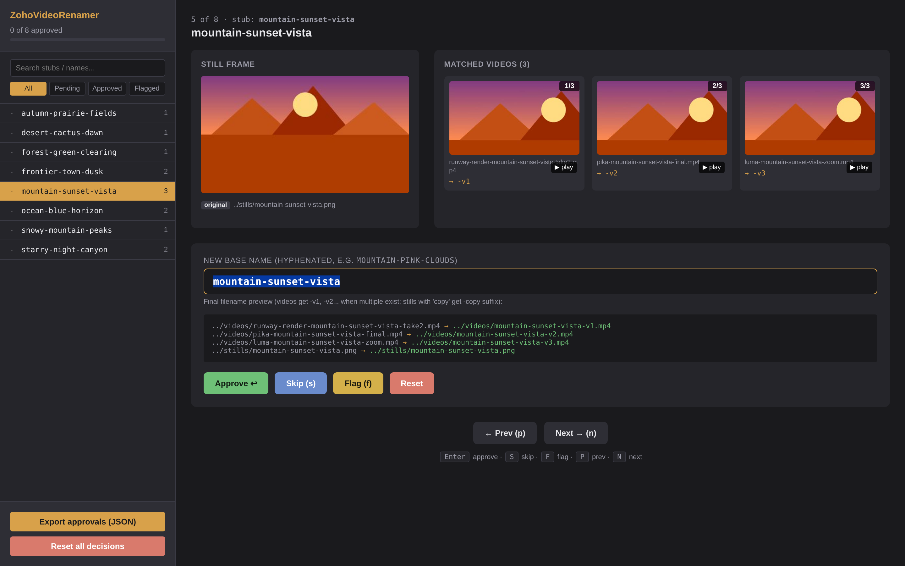

<p align="center">
  
</p>

# ZohoVideoRenamer

**🌐 [Landing page](https://princezoho.github.io/ZohoVideoRenamer/) · 💾 [Latest release](https://github.com/princezoho/ZohoVideoRenamer/releases/latest) · 📦 [Install via pip](#install)**

Match a folder of **videos** to a folder of **source stills**, propose descriptive names (from the still's existing filename OR via an AI vision API), review every pairing in a browser UI, and bulk-rename everything with a full undo log.



Built for the case where you have:

- A bunch of source images you used to generate or animate something (e.g. AI-generated stills, storyboard frames, key art)
- A bunch of resulting videos whose filenames carry some trace of the source image (e.g. `Gen-3 Alpha Turbo 1019957322, zoom out, ... 00290-3597567898 cop, M 5_prob4.mp4`)
- A wish to rename everything to clean, descriptive names so the project is navigable

## Why

AI video generators (Runway, Pika, Sora, Luma, etc.) tend to emit videos with filenames that embed the source-image filename. That makes matching solvable by simple substring search — no vision model required for the match itself. Vision only comes in if you want **descriptive names** (`saloon-night-shootout.mp4`) rather than the raw stub (`00290-3597567898.mp4`). If your stills are already nicely named, you can skip the AI step entirely.

## Features

- **Match videos → stills** by substring of still filename appearing in video filename
- **Two naming modes:**
  - **Use existing still names** — if your stills are already named (e.g. `mountain-sunset.png`), videos inherit those names
  - **AI proposes names** — vision API (Anthropic Claude or OpenAI GPT-4o) looks at each still and suggests a 3-word descriptive name
- **Browser review UI** — see each still side-by-side with its matched videos, edit the name, approve/skip/flag, keyboard shortcuts
- **Bulk rename with undo log** — every rename is logged so you can roll back the entire run with one command
- **Multiple videos per still** get `-v1`, `-v2`, `-v3` suffixes automatically
- **No data leaves your machine** — except API calls to your own AI provider (you bring your own key)

## Requirements

- Python 3.9+
- [ffmpeg](https://ffmpeg.org/) and `ffprobe` on your system `PATH`
- (Optional) An API key for [Anthropic](https://console.anthropic.com) or [OpenAI](https://platform.openai.com) if you want AI-generated names

## Install

**Don't want to deal with Python?** Download the desktop app from the [releases page](https://github.com/princezoho/ZohoVideoRenamer/releases/latest) — pre-built `.dmg` for macOS and `.exe` for Windows.

**Want the CLI?**

```bash
pip install zoho-video-renamer
```

Or from source:

```bash
git clone https://github.com/princezoho/ZohoVideoRenamer.git
cd ZohoVideoRenamer
pip install -e .
# pick one or both:
pip install anthropic    # for Anthropic Claude
pip install openai       # for OpenAI GPT-4o
```

## Quickstart (GUI)

```bash
zoho-video-renamer-gui
```

A native window opens. Pick your stills folder, pick your videos folder, optionally enter an AI key, hit Start. The review UI opens automatically when scanning completes.

## Quickstart (CLI)

```bash
# 1. Scan: walk both folders, match videos to stills, build thumbnails
zoho-video-renamer scan \
  -s ~/Pictures/source-stills \
  -v ~/Movies/generated-videos \
  -o ./review

# 2. (Optional) Ask an AI to propose 3-word descriptive names for each still
export ANTHROPIC_API_KEY=sk-ant-...    # or put it in a .env file
zoho-video-renamer ai-name -o ./review --provider anthropic

# 3. Open the review UI in your browser
zoho-video-renamer review -o ./review

# 4. In the browser: hit Enter on each entry to accept the suggested name,
#    edit any you want, then click "Export approvals (JSON)" to download
#    rename-approvals.json (usually lands in ~/Downloads/).

# 5. Dry-run, then execute. An undo log is written automatically.
zoho-video-renamer apply -o ./review -a ~/Downloads/rename-approvals.json
zoho-video-renamer apply -o ./review -a ~/Downloads/rename-approvals.json --execute

# 6. If anything looks wrong, undo:
zoho-video-renamer undo --log ./review/rename-undo-*.json --execute
```

## How matching works

The matcher looks at each video filename and tries to extract a "stub" that identifies the source image:

- Numeric ID patterns like `00290-3597567898` (common in AI image generators)
- Manual labels like `bg14`, `bg22b`
- `title-blah` patterns
- **Any literal substring** that matches one of your stills' filenames

So if your still is `mountain-sunset.png` and your video is `pika-render-mountain-sunset-v2.mp4`, the substring `mountain-sunset` will match.

If you have stills like `00290-3597567898.png` and videos like `Gen-3 Alpha Turbo 1019957322, zoom out, ... 00290-3597567898 cop, M 5_prob4.mp4`, the numeric pattern matches automatically.

## API keys & security

The tool only sends data to AI providers when you explicitly run the `ai-name` subcommand. It uses your own API key, which you can pass via:

1. `--api-key sk-...` on the command line
2. `ANTHROPIC_API_KEY` / `OPENAI_API_KEY` environment variable
3. A `.env` file in the current directory (see `examples/.env.example`)

`.env` is gitignored. The tool never logs your API key.

## Naming conventions

When you approve `mountain-pink-clouds` for an entry with one video and two stills (original + upscaled copy):

```
input:                            output:
mountain.mp4               →      mountain-pink-clouds.mp4
mountain.png               →      mountain-pink-clouds.png
mountain copy.png          →      mountain-pink-clouds-copy.png
```

With multiple videos per still:

```
mountain-a.mp4             →      mountain-pink-clouds-v1.mp4
mountain-b.mp4             →      mountain-pink-clouds-v2.mp4
mountain-c.mp4             →      mountain-pink-clouds-v3.mp4
```

You see the exact rename plan in the browser UI before approving, and again in the `apply --dry-run` output.

## Undo

Every `apply --execute` writes a timestamped undo log next to your project, e.g. `./review/rename-undo-20260526-085727.json`. To roll back:

```bash
zoho-video-renamer undo --log ./review/rename-undo-20260526-085727.json --execute
```

The undo log records each move as `(current path, original path)` so a partial-failure run is still reversible.

## Limits

- **Filename-based matching only.** If your video filenames don't contain any trace of the source still's name, the tool can't pair them. (Visual matching via perceptual hash is on the roadmap.)
- **AI naming runs serial API calls** with limited parallelism — large libraries (thousands of stills) will take a while and cost real money. Check your provider's pricing before running on a huge library.
- **Single-machine, single-user.** No multi-user state, no cloud sync. The whole "project" is a folder you can move or version-control.

## Contributing

Issues and PRs welcome. This is a single-developer project at the moment so response time may be slow. The codebase is small; start with `zoho_video_renamer/cli.py` to see how subcommands compose the lower-level modules.

## License

MIT — see [LICENSE](LICENSE).
